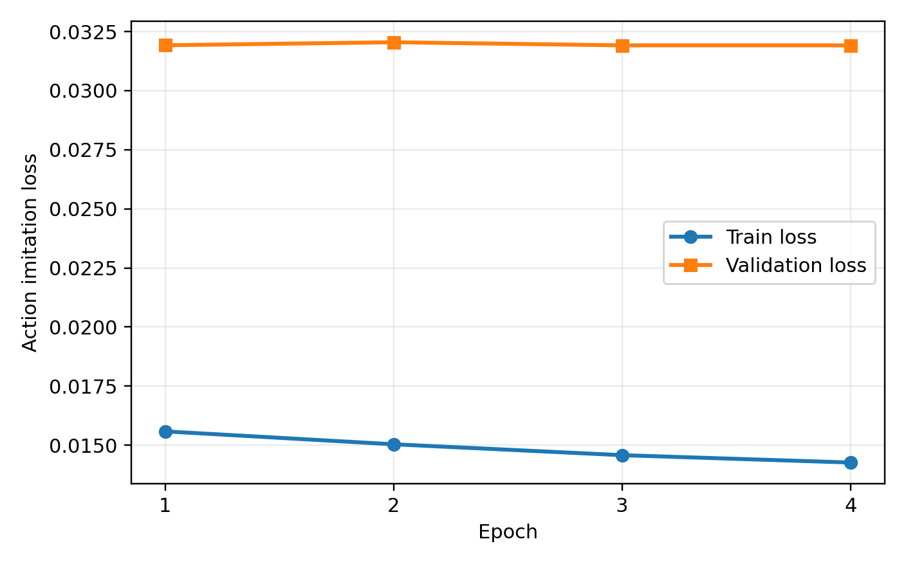
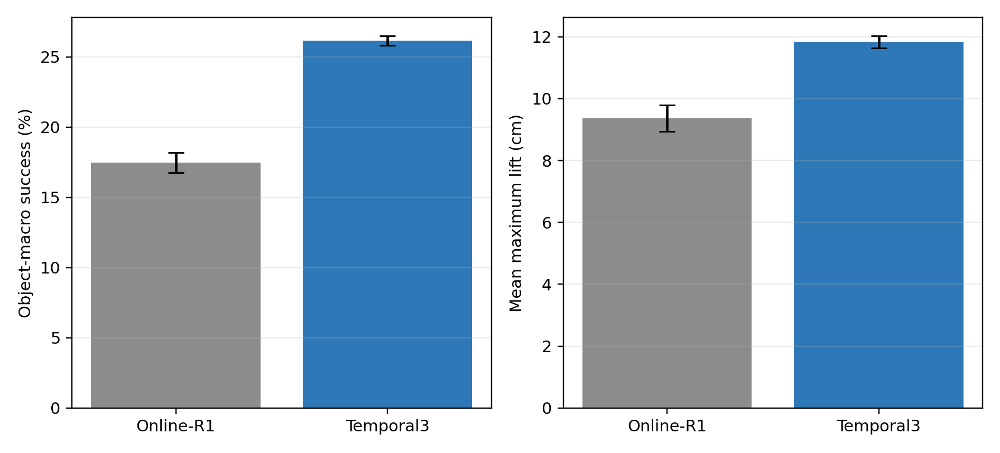
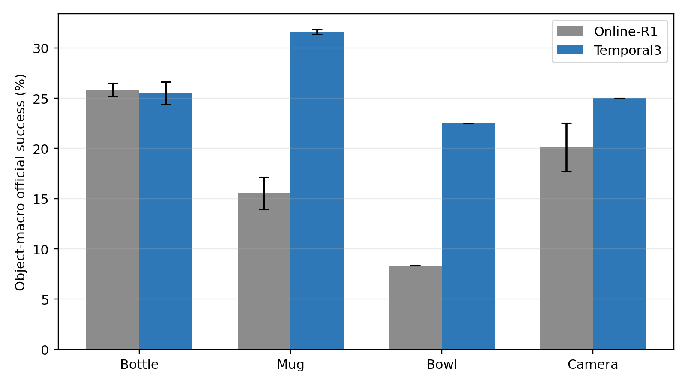
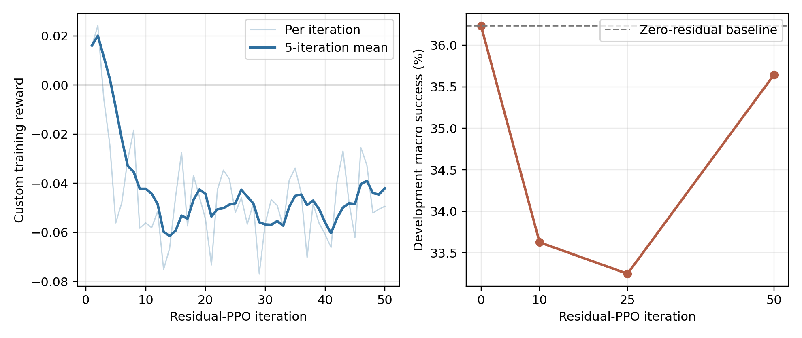

# 基于在线模仿与短时历史的多物体灵巧手抓取

## 1. 任务与实验设置

本实验基于 DexGraspMotionChallenge2025，在 Ubuntu 20.04、RTX 4060 Laptop 8 GB 和 Isaac Gym 上训练 Shadow Hand 抓取策略。研究对象为 Bottle、Mug、Bowl、Camera 四类：每类20个训练物体，共80个物体、1726条训练轨迹；每个训练物体另留出部分轨迹，共434条，用于同实例闭环验证。另冻结每类5个未见实例，其中12个开发物体用于选模，8个最终物体只在模型锁定后评测一次。所有结果均使用未修改的官方峰值成功标志，主要指标为物体宏平均成功率；最终结果重复3个仿真seed。

## 2. 方法

核心问题是行为克隆（BC）的闭环分布偏移：网络虽然能拟合示范状态上的动作，但一次小误差会改变手物接触，之后访问训练数据未覆盖的状态并继续累积误差。为此采用一条串行主线：

1. **BC Soup与类别教师**：以官方BC为起点，用±0.05观测噪声训练多个模型并平均权重；随后训练四个类别教师。
2. **统一Task-ID学生**：将类别one-hot编码与当前DexRep及本体状态拼接，蒸馏四个教师。Task-ID只是条件输入，策略仍是一个共享网络，并非推理时硬切换专家。
3. **Online-R1**：让统一学生在仿真中执行，在学生实际访问的状态上查询对应类别教师；训练批次中25%来自在线状态、75%来自原离线数据，缓解分布偏移。
4. **Temporal3**：从Online-R1初始化，当前时刻使用DexRep，并拼接最近3帧的100维本体状态和28维动作历史。历史直接进入共享MLP（隐藏层1024–1024–512–512），输出28维动作；没有额外GRU或Transformer。

早期曾在每类4个、共16个见过的物体上进行低成本串行诊断，用于定位流水线内部可能的能力损失。由于该子集只覆盖完整80个训练物体的20%，且不是未见物体测试集，其数值不作为总体性能或泛化结论，原诊断图不放入正式结果。下图只展示Temporal3的训练损失。

## 3. 结果

全80个训练实例的独立验证结果为119/434，总体成功率27.42%、物体宏成功率26.05%、平均最大抬升12.92 cm。分类别宏成功率为Bottle 35.27%、Mug 33.49%、Bowl 14.55%、Camera 20.88%；80个物体中19个零成功，其中Bowl占10个。这说明16物体审计略偏乐观，且主要困难在Bowl和Camera。

最终8个未见实例上，Temporal3在三个seed都超过Online-R1：

| 模型 | 成功数（3次） | 总体成功率 | 物体宏成功率 | 平均最大抬升 |
| --- | --- | ---: | ---: | ---: |
| Online-R1 | 45 / 42 / 42 | 19.91±0.65% | 17.46±0.72% | 9.37 cm |
| Temporal3 | **59 / 61 / 58** | **27.47±0.58%** | **26.15±0.33%** | **11.83 cm** |

Temporal3宏成功率绝对提高8.69个百分点，Mug、Bowl、Camera分别提高16.03、14.17、4.88个百分点，Bottle基本持平（-0.32点）。不过26.15%的绝对值仍低；它与80个见过实例的26.05%几乎相同，说明主要瓶颈不是新几何泛化，而是示范动作的闭环复现与偏离后的恢复。

本文也尝试了门控残差PPO、7帧历史、多尺度历史、未来动作辅助、全观测GRU、注意力残差、显式阶段编码和类别Temporal3专家，均未稳定超过Temporal3。以Temporal3为基础的50轮门控残差PPO在开发集上的宏成功率从零残差36.24%降至35.64%；训练reward也没有形成与官方成功率一致的改善，因此不进入最终评测。主模型属于模仿学习，其直接优化目标是动作损失；下图reward曲线来自该强化学习负结果。

单环境渲染中，Bottle和Mug成功抬升，最大高度变化分别为19.8 cm和48.8 cm；Bowl接近后未形成稳定包络，Camera则发生明显手物分离。预先在并行评测中稳定成功的Bowl/Camera轨迹，在单环境重放时失败，说明接触仿真还对并行环境布局和数值扰动敏感。图中标签严格采用本次渲染YAML的实际结果。

## 4. 理解与思考

实验最明确的结论是：离线loss不能代表灵巧手闭环能力。在线模仿让学生学习自己造成的偏离状态，是整条主线中收益最大的步骤；短历史帮助网络判断“接近—闭合—抬升”阶段，因此在未见实例上稳定提高成功率。但简单三帧拼接仍缺乏接触后的长期记忆和主动恢复能力，共享网络也在Bowl等类别上出现明显能力损失。

后续更值得研究的是：使用能够在学生偏离状态上给出可靠动作的闭环专家，迭代执行DAgger式数据聚合；引入接触感知的时序状态或分阶段恢复策略；在保持统一推理网络的前提下加入类别适配器，并重新冻结未见测试集验证。当前最终8物体已经访问，不能再用于后续选模。

参考：[挑战Wiki](https://github.com/DexGraspMotionChallenge/DexGraspMotionChallenge2025/wiki)、[DAgger](https://proceedings.mlr.press/v15/ross11a.html)、[Residual Reinforcement Learning](https://arxiv.org/abs/1812.03201)。
