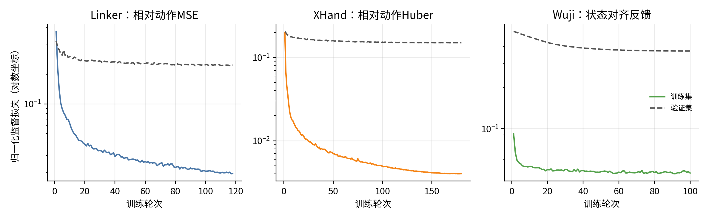
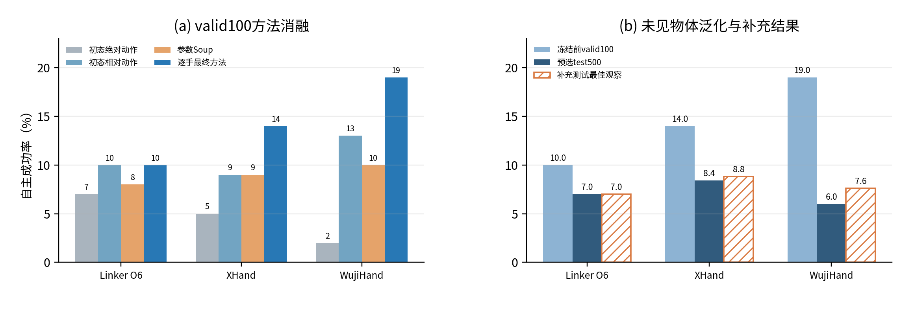

# 基于重定向轨迹的自主抓取策略探索

宛乐康

## 1. 测试方式与数据划分

基础任务得到的是可以重放的完整抓取轨迹，进阶任务则要用这些轨迹训练一个能够独立执行的策略。我在这里采用最严格的测试方式：专家动作只在训练时作为标签；episode开始时，策略只获得首帧手腕姿态、张开的手指状态和物体状态，之后的手腕与手指命令全部由网络输出，不再读取该物体的后续轨迹。

数据仍来自基础任务的**50类、100个物体、1000条重定向轨迹**。每类两个物体中，一个物体提供8条train和2条valid，另一个物体的10条全部留作test，形成400/100/500条的对象级划分。训练和验证只使用重放成功的演示，实际分别剩下Linker 89/23条、XHand 256/61条、Wuji 270/73条；test的500条则全部保留。网络输入包括手关节位置与速度、物体位姿与速度、接触数和14维物体形状描述。成功标准与基础任务一致：抬升至少30 cm，并在最后0.5秒保持高度和接触。

## 2. 从失败方案到最终方法

我先尝试了普通行为克隆，随后加入三帧历史和Diffusion动作生成。虽然离线loss能够下降，但放回仿真后几乎全部失败：前几步出现偏差后，手会进入训练数据中没有见过的状态，后面的动作也随之偏离。我还做过PPO手指残差跟踪器，它在已知轨迹附近效果更好，但测试时需要读取专家轨迹，因此不能算自主抓取。KNN和局部回归也需要在测试时保存并检索训练轨迹，最终同样没有作为正式方法。

针对逐步预测容易累积误差的问题，我改用**初始状态+动作阶段**的表示。网络先保存开始时的手—物状态，再根据当前阶段直接预测相对初始手姿的完整动作，因此不会把上一时刻的动作误差继续累加。Linker使用MSE；XHand改用对异常值不那么敏感的Huber损失；Wuji则额外输入三帧真实状态，并把反馈修正限制在0.1以内。Wuji训练时用DAgger采集偏离专家轨迹后的状态，但测试时教师关闭，只保留训练后的网络。

图中实线是训练loss，虚线是验证loss，纵轴为对数坐标。三只手的训练loss都很快下降，但验证loss下降较慢，并且较早停止改善。这说明网络能够记住训练演示，却不一定能处理执行时由自身误差产生的新状态。因此我没有按最低训练loss选择模型，而是比较它们在valid中的实际抓取成功率。

<!-- PAGE_BREAK -->

## 3. 最终测试结果

我先用完整valid100选择每只手的模型和参数，确定后再对50个训练中未见的物体各测试10次。测试程序开启`autonomous_only`，不加载教师、专家手腕或参考轨迹残差。

| 目标手 | 最终自主方法 | valid100 | 未见物体test500 |
| --- | --- | ---: | ---: |
| LinkerHand O6 | InitialPhase + MSE | 10/100（10.0%） | 35/500（7.0%） |
| XHand | InitialPhase + Huber | 14/100（14.0%） | **42/500（8.4%）** |
| WujiHand | InitialPhase + Temporal/DAgger小反馈 | 19/100（19.0%） | 30/500（6.0%） |

图(a)比较的是同一valid100：直接预测绝对动作时三只手分别为7%/5%/2%，改成相对初态后提高到10%/9%/13%，而参数平均为8%/9%/10%。这次对比让我保留了相对初态表示；在此基础上，XHand使用Huber达到14%，Wuji加入小幅时序反馈后达到19%。图(b)分别列出valid、正式test和后续补充实验，三者没有混在一起统计。

XHand在test中表现最好，我认为Huber损失减轻了少量异常动作对回归结果的影响。Wuji在valid上达到19%，但换到未见物体后只有6%，说明三帧反馈仍较依赖训练物体附近的状态。Linker受6个耦合主动量限制，最终为7%，但在19个类别中至少成功过一次。三手成功率的95% Wilson区间分别为5.1%–9.6%、6.3%–11.2%和4.2%–8.4%，这些区间仍有重叠，因此不能仅凭几个百分点判断哪种手或损失一定更好。

正式结果确定后，我又把几个在开发集上较接近的参数各测试了500条。Linker微调和Wuji较弱反馈都没有提高；XHand另一组Huber参数得到44/500，与主模型42/500接近；Wuji把原反馈策略与25% Fourier时间策略融合后得到38/500，成功类别从18类增加到23类。不过这个融合模型在valid上只有17/100，低于预先选择的19/100，因此报告仍以上表的30/500作为正式结果，38/500只记录为后续尝试。

## 4. 失败分析与思考

我分别选择了三只手的一条成功和一条失败轨迹。随附视频中，Linker抓USBStick、XHand抓Can和Wuji抓Can能够保持抓取并稳定抬升；Linker抓Ipad、XHand抓Battery和Wuji抓CerealBox则在短暂抬起后脱落。这六段视频都是最终模型在Isaac Gym中的闭环执行结果，没有读取未来专家动作。

逐帧检查后，我把失败主要分为三类：接近位置有偏差、手指没有形成对向夹持，以及抬起后逐渐滑落。当前网络只看到总接触数，不知道具体哪根手指接触、接触力有多大，也没有局部表面法向，因此很难针对滑移主动收紧某根手指。下一步我会优先加入分手指接触和力信息，并用更多扰动状态训练反馈部分。这次实验也提醒我，离线loss下降只能说明动作拟合得更接近，最终是否学会抓取仍要用未见物体上的闭环执行来判断。
