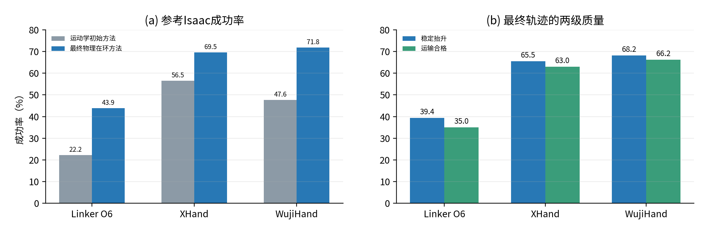

# 三种五指灵巧手的抓取轨迹重定向

宛乐康

## 1. 任务是什么

DexGraspMotionChallenge2025 提供的是 Shadow Hand 的成功抓取轨迹，但换成另一种灵巧手后，手指长度、关节数量、转动方向和机械耦合方式都会变化。我把这个任务理解为一种“动作翻译”：不能直接复制 Shadow Hand 的关节角，而要让结构不同的手尽量复现接近、闭合和抬升这三个抓取阶段。

为了覆盖题目规定的 6–20 自由度范围，我选择了 LinkerHand O6、XHand 和 WujiHand。三者分别有 6、12、20 个主动手指自由度，代表低、中、高三种控制能力；URDF与网格均来自题目给出的[参考工程](https://github.com/ChenhaoXiong82/HandRetargetTask2026)，加载后又逐一核对了关节名称、限位和左右手方向。仿真中还要控制6维手腕，因此每帧最终控制量分别为12、18和26维。把三种构型放在一起，也能直观看出机械耦合和自由度数量对重定向效果的影响。

我使用固定随机种子，在50个物体类别中每类抽取2个实例，每个实例再抽取10条轨迹，最终得到100个物体、1000条 Shadow Hand 轨迹。每条原始轨迹包含70帧；重定向后，在 Isaac Gym 中把每帧插值为3个60 Hz物理步，并在末尾保持30步，共执行240步（4秒）。这样既给电机留出跟随时间，也能观察物体在抬升后是否滑落。

## 2. 从“形状相似”走向“物理上抓得住”

第一步仍然是运动学重定向：XHand和Wuji匹配掌心、指节和指尖等15个同名位置；Linker只有6个主动电机并带有mimic耦合，无法独立控制所有指节，因此匹配掌到指尖、掌到近端以及手指方向等功能向量。SLSQP逐帧调整手腕和关节角，上一帧的解作为下一帧初值，得到一条连续的70帧目标手轨迹。

但几何误差小不等于抓得牢。很多轨迹看起来像Shadow手型，进入PhysX后仍会碰偏、夹不紧或抬起后滑落。因此最终方法把运动学结果只当作初值，再直接用仿真中的抓取表现优化轨迹。Global CEM先采样少量全局参数，例如手腕平移、旋转和分指闭合偏置；每个候选都在Isaac Gym里完整执行，稳定抬升、末段接触和掌物相对滑移共同决定分数。Linker的结构约束最强，因此额外执行一次相同的全局细化。

随后把真实抓取轨迹中的关节变化做PCA，冻结前5个主要协同方向。最终Rank-5 CEM不再分别搜索几十个关节，而是只搜索这5个“整手协同动作”在闭合、抬升等阶段的强度。这样既能改变握力和对向关系，又不容易产生单个关节突变。CEM修改过的轨迹还必须与上一阶段基线各独立重放两次；只有候选两次都稳定且平均得分明显更高才会保留，否则自动恢复基线。

<!-- PAGE_BREAK -->

## 3. 如何判断真正成功

题目没有规定必须抬升30 cm。参考Isaac代码把目标放在台面上方30 cm，并给出15 cm半径：物体曾进入这个目标区域即记为参考成功。为了避免把“碰巧弹起后掉落”当成高质量专家，我另外报告更严格的质量指标：最后0.5秒都至少抬升15 cm，保持接触，高度波动不超过1 cm、峰值到终点回落不超过3 cm；物体相对手掌的最大平移和旋转还要分别不超过3 cm和30°。只有通过这套稳定运输门的轨迹才进入进阶训练。

所有数字均来自同一50类、100物体、1000轨迹集合。运动学初始方法和最终方法使用同一冻结协议重新统计，因此提升不来自更换成功定义。

| 目标手 | 运动学初始：参考成功 | 最终方法：参考成功 | 末段稳定 | 稳定运输/可训练 |
| --- | ---: | ---: | ---: | ---: |
| LinkerHand O6 | 222（22.2%） | **439（43.9%）** | 394（39.4%） | **350（35.0%）** |
| XHand | 565（56.5%） | **695（69.5%）** | 655（65.5%） | **630（63.0%）** |
| WujiHand | 476（47.6%） | **718（71.8%）** | 682（68.2%） | **662（66.2%）** |

## 4. 成功、失败与我的理解

最终视频将分别展示三只手的稳定运输成功、抬升后滑落和从未形成承力接触三类结果。这里不再只展示最大抬升高度，而会同时给出末段高度、接触以及掌物相对运动，避免视觉上“看起来抬起来了”却不满足稳定抓取。

从结果看，20自由度Wuji最高，12自由度XHand接近70%，6主动自由度的Linker仍最困难；但Linker参考成功率也从22.2%提高到43.9%，说明物理反馈弥补了纯几何目标看不到的接触问题。另一方面，重复确认只接受了37/244、25/184和43/154条Rank-5改动，大量单次表现更好的候选无法稳定复现。这让我认识到，抓取质量不应由某一帧高度或一次仿真决定，而要同时考虑目标到达、持续稳定、掌物相对滑移和重复性。
